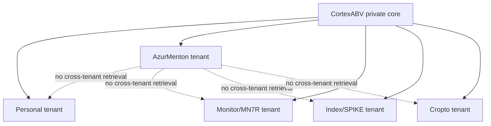

# CortexABV Tenant & Project AI Engine Contract v1

CortexABV is the owner-controlled private AI engine for both personal and project AI surfaces. It is not a shared RAG index.

## Isolation

Every tenant is fixed to:

- `retrievalScope: tenant_only`;
- `crossTenantAccess: deny`;
- `actionAuthority: none`.

This means an AzurMenton guest cannot retrieve personal CV/context, MN7R/Monitor data, Index/SPIKE evidence, Cropto data, or any source credential. The same isolation applies in reverse.

## AzurMenton path

AzurMenton is marked `wholly_owned`. Its planned external surface is `read_only_guest_chat`, not booking automation or a general assistant. Before implementation it needs all four prerequisites:

1. a versioned guide/content source pack with provenance;
2. a guest-chat policy that bounds topics, factual claims and escalation;
3. a shadow evaluation pack built from real guide questions;
4. human approval.

The chat remains read-only even after those gates: no booking mutation, pricing assertion without a verified source, guest-data ingestion into another tenant, or cross-project retrieval.

The first prerequisite now has a concrete manifest and policy skeleton: [AzurMenton Source Pack v1](AZUR_MENTON_SOURCE_PACK_V1.md). The next prerequisite now has a bounded scenario contract: [AzurMenton Shadow Evaluation Pack v1](AZUR_MENTON_SHADOW_EVALUATION_V1.md). Both remain static contracts rather than a chat implementation.

## Owner-controlled project tenants

Monitor/MN7R, Index/SPIKE and Cropto each retain a separate scoped tenant. The contract does not claim they have the same ownership model as AzurMenton: it records them as owner-controlled projects that may have partners. A project tenant can receive only its own approved source packs and can prepare no external action by default.

## Non-goals

This manifest introduces no runtime tenant router, RAG store, endpoint, credential, chat UI, social publishing or project mutation. Such a capability needs a tenant-specific source pack, policy, evaluation, consent/approval boundary and separate implementation.
