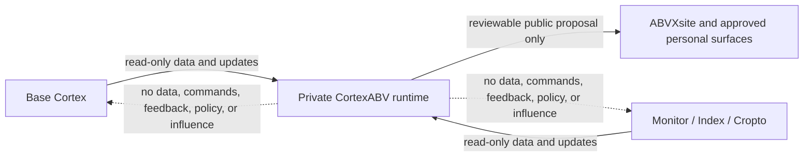

# CortexABV Read-Only Import Contract v1

This document fixes the one-way relationship between the private CortexABV runtime, the base Cortex, and the owner's project ecosystems.

The machine-readable declaration is [`cortex-abv/cortex-import-contract.v1.json`](../cortex-abv/cortex-import-contract.v1.json).

## Direction and ownership

The base Cortex is an inbound-only source for CortexABV. CortexABV may receive its authorized public or protected data and updates, but the base Cortex cannot retrieve data from CortexABV and receives no CortexABV command, feedback, policy, workflow state, or runtime influence.

The same boundary applies to the owner's project ecosystems: Monitor, Index and every system within it, and Cropto. They are owned projects that may provide updates to CortexABV so it can maintain the owner's personal presence, but CortexABV does not operate, modify, or influence their product runtime, data, decisions, or corporate Cortex.

## Import and storage boundary

"Read-only import" permits CortexABV to receive public or protected material from an authorized source. It does not make that material public, transferable, or usable as instruction authority.

Protected imports, personal records, credentials, contact data, raw traces, and source documents belong only in the separately deployed private CortexABV runtime and store. They must never be committed to ABVXsite, its public artifacts, Actions logs, receipts, or generated indexes.

No endpoint, token, webhook, scheduler, or runtime integration is introduced by this contract.

## Personal-surface proposals

CortexABV may use imported evidence to prepare proposals for the owner's personal surfaces, such as ABVXsite, an owner-controlled repository, or LinkedIn. That path is separate from every source ecosystem:

1. an inbound source supplies evidence and provenance to private CortexABV;
2. CortexABV prepares a bounded proposal for an owner-controlled surface;
3. the target surface applies its own validation and human approval policy.

There is no response path from that proposal back into the base Cortex, Monitor, Index, Cropto, or their corporate Cortex. A public update is never evidence that a source system has been changed or endorsed it.

## Wholly owned project tenants

Private CortexABV may later host isolated tenants for wholly owned projects such as AzurMenton. Such a tenant can use only its own reviewed source pack and policy; it cannot retrieve from the personal tenant, any partner-project tenant, or this public-site adapter.

AzurMenton's current contracts are static and private: a versioned guide/FAQ/place manifest with provenance, a read-only guest-chat policy skeleton, and a shadow-only scenario pack. They do not provide an endpoint, model, guest-data store, booking/availability access, payment handling, or public publishing authority. They must not be copied into ABVXsite's public indexes or interpreted as a deployed assistant.

## Non-goals

This contract does not implement retrieval, replication, synchronization, mutations, feedback loops, cross-system tasks, shared memory, or autonomous social publishing. Any future import adapter needs a separate typed schema, source credential scope, data classification, provenance record, retention policy, and tests before it can run.
